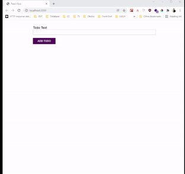

# Projects Drag and Drop

## Contents

- [Description](#description)
- [Project Preview](#preview)
- [Features](#features)
- [Installation](#installation)

## Preview

<div style="text-align:center">

</div>

## Description

In this project I learn how to implemented my learning progress in typescript. I make simple todo list (yet another todo list project) with react and typescript.

## Features

- Add project
- Drag and Drop
- Move project from active into finished and vice versa
- typescript
- OOP (Object-Oriented Programming)

## Installation

1. Open your terminal or command prompt
2. Clone the project

```bash
$ git clone https://github.com/sipamungkas/react-typescript-todolist.git
```

3. Move inside the directory and install and link dependency

```bash
$ cd react-typescript-todolist
$ yarn install
```

4. Run the project

```bash
$ yarn start
```

### Thank you :)
